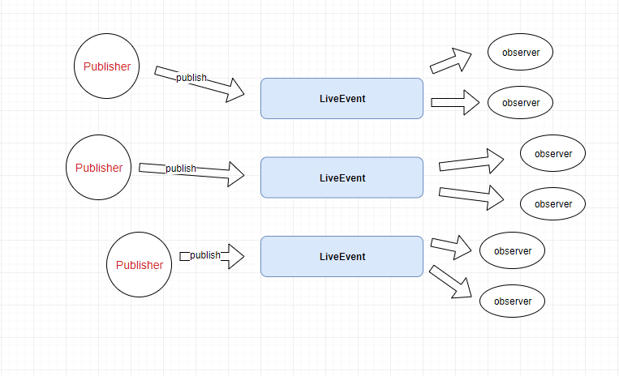

## 如何使用

增加

``` gradle
 repositories {
    maven { url "https://jitpack.io" }
 }
```

引入

``` gradle
implementation 'com.github.jarofcolor:LiveBus:1.1.0'
```

## 说明

LiveBus为一款轻量的事件总线库，其设计理念为观察订阅模式，与其它事件总线不同的是，订阅和发布直接针对事件本身，而不需要中间调度，所有的事件抽象为`LiveEvent`，`LiveEvent`
支持对事件的订阅与发布，支持线程分发，支持生命周期控制下的自动移除。

> 流程图如下



## 如何使用

## 导入

增加

``` gradle
 repositories {
    maven { url "https://jitpack.io" }
 }
```

引入

```gradle
implementation 'com.github.jarofcolor:droidfun:0.0.1'
```

### 接入说明

1、获取`LiveEvent`

``` kotlin
val liveEvent = LiveBus.get(String::class.java) //获取用于处理String类型的事件
```

2、注册事件

``` kotlin
    liveEvent.observe(ThreadMode.BACKGROUND,busLifecycle){
            //TODO
    }

    //注册一个在background线程中处理的事件
```

3、发布事件

``` kotlin
    editText.addTextChangedListener {
        //发送事件
        LiveBus.get(String::class.java).value = it.toString()
    }

    //在主线程中发布了一个String类型的事件，此时所有的String类型的观察者都会收到事件
```

4、取消订阅

``` kotlin
    busLifecycle.destroy() //取消订阅
```

5、获取某个事件缓存的最新值

``` kotlin
    LiveBus.get(String::class.java).value
    //每种事件都缓存有一个最新值可直接获取
```

6、支持的线程模型

``` java
public enum ThreadMode {
    POSTING,  //发布线程和处理线程一致
    MAIN, //主线程处理
    MAIN_ORDERED, //在主线程队列中处理
    BACKGROUND, //在background子线程中排队处理
    ASYNC //在子线程中处理，线程不唯一
}
```

## 总结

该项目的线程模型借鉴于EventBus，实现上有所参考，详情请查阅项目源码，项目继续完善中，欢迎指正。
